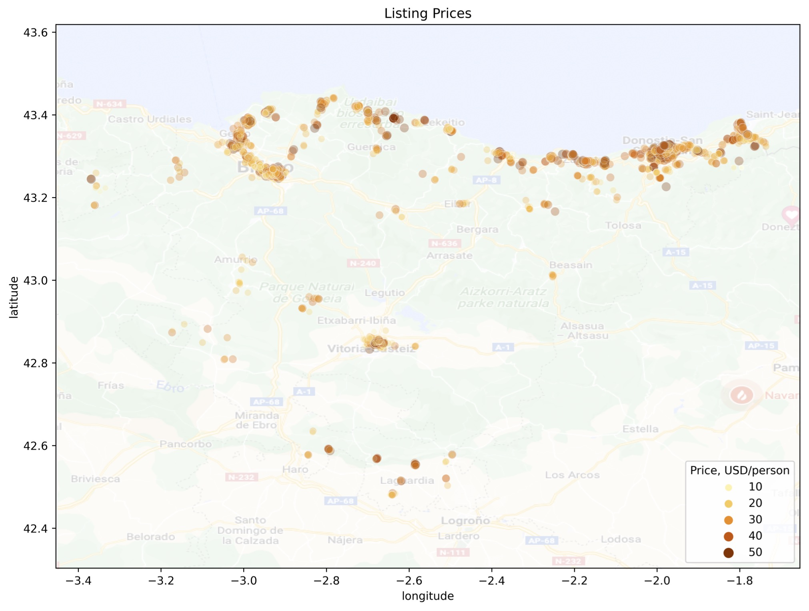

# Planning Your Next Vacation in Spain

Subtitle: A data-based approach using AirBnB's dataset from the Basque Country

[Donostia-San Sebastian: Photo by @ultrashricco from Unsplash](https://unsplash.com/photos/8KCquMrFEPg)

In 2020 I decided to move back to my birthplace in the [Basque Country](https://en.wikipedia.org/wiki/Basque_Country_(autonomous_community)) (Spain) after almost 15 years in Munich (Germany). The Basque region in Spain is a popular touristic destination, as it has a beautiful seaside with a plethora of surf bays and alluring hills that call for hiking and climbing adventures. Culture and gastronomy are also important features, both embedded in a friendly and developed society with modern infrastructure.

When the pandemic seemed to start fading away in spring 2022, friends and acquaintances from Europe began asking me about the best spots and trips in the region, hotels and hostels to stay in case there was no room in my place, etc. The truth is, after so many years abroad I was not the best person to guide them with updated information; however, the [AirBnB dataset from *Euskadi*](http://insideairbnb.com/get-the-data/) (i.e., Basque Country in [Basque language](https://en.wikipedia.org/wiki/Basque_language)) has clarified some of my questions. The dataset contains, among others, a list of 5228 accomodations, each one of them with 74 variables.

Following the standard [CRISP-DM process](https://en.wikipedia.org/wiki/Cross-industry_standard_process_for_data_mining) for data analysis, I have cleaned, processed and modelled the dataset to answer three major business questions:

1. **Prices**. Is it possible to build a model that predicts the price given the variables? If so, which are the most important variables that determine the price? Can we detect accommodations that, having a good review score, are a bargain?
2. **Differences between accomodations with and without beach access**. Surfing or simply enjoying the seaside are probably some important attractions visitors seek on their vacations. However, not all accommodations are a walk distance from a beach. How does that influence the features of the housings?
3. **Differences between the two most important cities: [Donostia-San Sebastian](https://en.wikipedia.org/wiki/San_Sebastián) and [Bilbao](https://en.wikipedia.org/wiki/Bilbao)**. These province capitals are the biggest and most visited cities in the Basque Country; in fact, their listings account for 50% of all offered accommodations. However, both cities are said to have a different character: Bilbao is a bigger, modern city, without beach access but probably with a richer cultural offerings and nightlife; meanwhile, Donostia-San Sebastian is aesthetic, it has three beaches and it's perfect for day-strolling. How are those popular differences reflected on the features of the accommodations?

In the following, I provide a brief explanatory section on the data processing I carried out. The remainder of the blog post focuses on the three questions introduced above.

## The Dataset and Its Processing

If you'd like go directly to the meet, you can skip this section. Here, I give an overview of most what is done in all the four notebooks of my [Gihub repository](https://github.com/mxagar/airbnb_data_analysis) that help answer the questions pose above. Those preliminary steps consist of the data cleaning, the feature engineering and selection and the data modelling.

AirBnB provides with several CSV files for each world region: (1) a listing of properties that offer accommodation, (2) reviews related to the listings, (3) a calendar and (4) geographical data. A detailed description of the features in each file can be found in the official [dataset dictionary](https://docs.google.com/spreadsheets/d/1iWCNJcSutYqpULSQHlNyGInUvHg2BoUGoNRIGa6Szc4/edit#gid=982310896).

My analysis has concentrated on the listings file, which consists in a table of 5228 rows/entries (i.e., the accommodation places) and 74 columns/features (their attributes). Among the features, we find **continuous variables**, such as:

- price of the complete accommodation,
- maximum number of persons that can be accommodated,
- review scores for different dimensions,
- reviews per month,
- longitude and latitude,
- etc.

... **categorical variables**, such as:

- neighbourhood name,
- property type (apartment, room, hotel, etc.)
- licenses owned by the host,
- amenities offered in the accommodation, 
- etc.

... **date-related data**, such as:

- first and last review dates, 
- date when the host joined the platform,

... and **image and text data**:

- URL of the listing,
- URL of the pictures,
- description if the listing,
- etc.

Of course, not all features are meaningful to answer the posed questions. Additionally, a preliminary exploratory data analysis shows some peculiarities of the dataset. For instance, in contrast to city datasets like [Seattle](https://www.kaggle.com/datasets/airbnb/seattle) or [Boston](https://www.kaggle.com/datasets/airbnb/boston), the listings from the Basque country are related to a complete state in Spain; hence, the neighbourhoods recorded in them are, in fact, cities or villages spread across a large region. Moreover, the price distribution shows several outliers and the price value is relative to the complete accommodation, i.e., not unitary per person. Along these lines, I have performed the following simplifications:

- Only the 60 (out of 196) neighbourhoods (i.e., cities and villages) with the most listings have been taken; these account for almost 90% of all listings. That reduction has allowed to manually encode neighbourhood properties, such as whether a village has access to a beach in less than 2 km (Question 2).
- Only the listings with a price below 1000 USD have been considered.
- The price has been divided by the number of accommodates, to get a price per person.
- The features that are irrelevant for modelling and inference have been dropped (e.g., URLs and scrapping information).
- From fields that contain medium length texts (e.g., description), only the language has been identified with [spaCy](https://spacy.io/universe/project/spacy-langdetect). The rest of the text fields have been encoded as categorical features.

As far as the **data cleaning** is considered, only entries that have price (target for Question 1) and review values have been taken. In case of more than 30% of missing values in a feature, that feature has been dropped. In other cases, the missing values have been filled (i.e., imputed) with either the median or the mode.

**Feature engineering** methods have been applied to almost all variables:

- Any numerical variable with a skewed distribution has been either transformed using logarithmic or power mappings or binarized.
- Categorical columns have been [one-hot encoded](https://en.wikipedia.org/wiki/One-hot).
- All features have been scaled to the region `[0,1]`.

The dataset that results after the feature engineering consists of 3931 entries and 354 features. We have almost 5 times more features than in the beginning even with dropped variables because each class in the categorical variables becomes a feature; in particular, there are many amenities, property types and neighbourhoods.

In order to prevent overfitting and make the interpretation easier, I have carried a [lasso regression](https://en.wikipedia.org/wiki/Lasso_(statistics)) to perform **feature selection**. Lasso regression is a L1 regularized regression which forces the model coefficients to converge to 0 if they have small values; subsequently, the features with null coefficients can be dropped. That reduces the number of variables from 354 to 120. Thus, the final dataset has 3931 entries and 120 features. It is split into 90% for training the models and 10% for testing them.

## Question 1: Prices

<!--
-->

<!--
-->

## Question 2: To Beach or not to Beach

## Question 3: Athletic de Bilbao vs. Real Sociedad

If you're a soccer fan, maybe you've heard about the Basque derby: [Athletic de Bilbao](https://en.wikipedia.org/wiki/Athletic_Bilbao) vs. [Real Sociedad](https://en.wikipedia.org/wiki/Real_Sociedad). Both football teams are originally from the two major cities, Bilbao and Donostia-San Sebastian, and they represent the healthy rivalry between the two province capitals. 

## Conclusions

1. A
2. B
3. C

These conclusions are quite informal, but I hope they can guide my data-savvy friends; in any case, I'm sure you can have a great vacation anywhere you go in the Basque Country :)

> Are you plannig a trip to the Basque Country? Has this blog post helped you?

To learn more about this analysis, see the link to my [Gihub repository](https://github.com/mxagar/airbnb_data_analysis). You can download the pre-processed dataset and ask the data your own specific questions!

